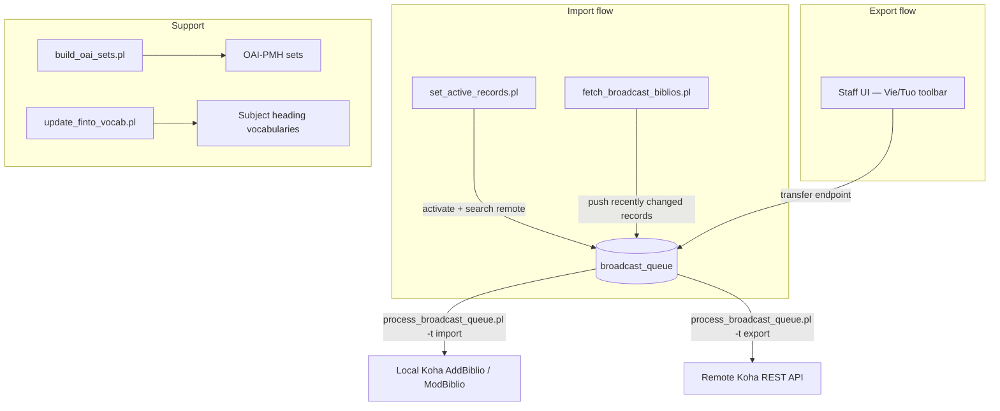

# Broadcast Biblios — *Tietuesiirtäjä*

> **Version:** 2.6.0 · **Author:** Johanna Räisä (Koha-Suomi Oy) · **Minimum Koha:** 25.05.00 · **License:** GPL v2+

A Koha plugin for bidirectional bibliographic record synchronization between multiple Koha instances and national-level library catalogs (Melinda, Täti, Vaari). Records can be pulled into the local Koha from a remote interface (**import**) or pushed from the local Koha to a remote interface (**export**). A Vue 3 UI injected into the staff intranet catalog detail page lets cataloguers search, compare, import, and export records interactively.

---

## Table of Contents

1. [Architecture](#architecture)
2. [Requirements](#requirements)
3. [Installation](#installation)
4. [Database Tables](#database-tables)
5. [Configuration](#configuration)
6. [Cronjob Reference](#cronjob-reference)
7. [REST API Reference](#rest-api-reference)
8. [Staff UI](#staff-ui)
9. [Module Reference](#module-reference)
10. [FINTO Vocabulary Updater](#finto-vocabulary-updater)
11. [i18n](#i18n)

---

## Architecture

The plugin operates in two data-flow directions. Both flows converge on a shared queue table that is processed by `process_broadcast_queue.pl`.



**Key components:**

| Component | Role |
|---|---|
| `BroadcastBiblios.pm` | Plugin entry point; hooks, permissions, config/report pages |
| `Modules/Broadcast.pm` | Incremental export engine; finds locally changed records and queues them |
| `Modules/BroadcastQueue.pm` | Queue processor; applies imports and sends exports |
| `Modules/ActiveRecords.pm` | Registry of "active" biblios and their canonical identifiers |
| `Modules/REST.pm` | Mojo-based generic REST client |
| `Modules/SRU.pm` | SRU 1.1/2.0 protocol client |
| `Modules/Users.pm` | Per-interface credentials; basic auth + OAuth2 client credentials |
| `Helpers/CompareRecords.pm` | Field-level MARC diff engine |
| `Helpers/MergeRecords.pm` | Interface-specific MARC merge strategies |
| `Helpers/Identifiers.pm` | Canonical identifier extraction from MARC |
| `js/` | Vue 3 + Pinia staff UI injected into catalog detail toolbar |

---

## Requirements

- Koha ≥ 25.05.00
- `<enable_plugins>1</enable_plugins>` in `koha-conf.xml`
- `<pluginsdir>` must exist and be writable by the web server
- Apache must allow access to `pluginsdir`

---

## Installation

1. Download the latest `.kpz` file from the [Releases](../../releases) page.

2. Enable the plugin system in `koha-conf.xml`:

   ```xml
   <enable_plugins>1</enable_plugins>
   ```

3. Confirm that `<pluginsdir>` exists, is correct, and is writable by the web server.

4. Allow Apache access to the plugin directory:

   ```apache
   <Directory /path/to/pluginsdir>
       Options Indexes FollowSymLinks
       AllowOverride None
       Require all granted
   </Directory>
   ```

5. Restart Apache.

6. In the Koha staff interface go to **Administration → Plugins** and upload the `.kpz` file.

7. Enable the `UseKohaPlugins` system preference.

8. Run the plugin installer to create database tables:

   ```sh
   perl misc/create_tables.pl
   ```

---

## Database Tables

| Table (suffix after `koha_plugin_fi_kohasuomi_broadcastbiblios_`) | Purpose |
|---|---|
| `log` | Tracks the last successfully processed biblio timestamp per operation type, enabling incremental processing |
| `activerecords` | Registry of "active" biblios with their canonical identifier (Melinda/ISBN/EAN/BTJ); records not in this table are ignored |
| `queue` | Pending, processing, and completed import/export queue items; stores MARC payload, field diff, and component parts |
| `users` | Per-interface credentials: username, encrypted password (HS256 JWT) or OAuth2 client credentials and cached access token |

---

## Configuration

Interface configurations are stored in the Koha plugin data storage and managed through the plugin's **Config** page (Vue UI) or directly via the `PUT /broadcast/config` endpoint.

### Plugin-wide settings

| Setting | Description |
|---|---|
| `notifyfields` | MARC fields whose changes trigger notifications (e.g. `650`, `100`) |
| `secret` | HS256 signing secret used to encrypt stored passwords |

### User credentials

Users are stored in the `broadcastbiblios_users` table. Two authentication types are supported:

| `auth_type` | Description |
|---|---|
| `basic` | Username + password. Password is stored encrypted with the plugin `secret`. |
| `oauth` | OAuth2 client credentials flow. Client ID and secret stored; access token cached in DB and refreshed automatically. |

Example SQL inserts: [`examples/insert_basic_user.sql`](Koha/Plugin/Fi/KohaSuomi/BroadcastBiblios/examples/insert_basic_user.sql) and [`examples/insert_oauth_user.sql`](Koha/Plugin/Fi/KohaSuomi/BroadcastBiblios/examples/insert_oauth_user.sql).

---

## Cronjob Reference

Run these scripts from the `Koha/Plugin/Fi/KohaSuomi/BroadcastBiblios/cronjobs/` directory. The recommended operational sequence is:

### Step 1 — Build the active records table (one-time or full refresh)

```sh
perl set_active_records.pl --all
```

Scans all local biblios and registers them in the `activerecords` table. Identifier priority order:

1. `035$a` — `FI-MELINDA` or `FI-BTJ` values
2. `020$a` — ISBN
3. `024$a` — EAN / ISMN
4. `003|001` — only when `003` is `FI-BTJ`

Records already in the table and component parts are skipped.

### Step 2 — Activate new records and pull from import interface (cron)

```sh
perl set_active_records.pl
```

The activation interface is read from the plugin configuration (`activationInterface`).

| Flag | Description |
|---|---|
| `-v`, `--verbose` | Verbose output |
| `-c`, `--chunks` | Process biblios in chunks (default: 200) |
| `-b`, `--biblionumber` | Start processing from a specific biblionumber |
| `-l`, `--limit` | Limit the number of biblios processed |

1. Activates the record (registers its identifier).
2. Searches the configured activation interface for a matching copy.
3. If found, adds the remote record to the queue for import.

> Set in crontab; run frequently (e.g. every 5–15 minutes).

**Prerequisites:** activation interface set in plugin config + a user record with `edit_catalogue` permission on the remote Koha. OAuth is recommended.

### Step 3 — Broadcast local changes to export interfaces (cron)

```sh
perl fetch_broadcast_biblios.pl --block_component_parts --blocked_encoding_level "5|8|u|z"
```

1. Finds locally modified biblios since last run (tracked by the `log` table).
2. Checks if each biblio is activated on any configured import interface.
3. If activated, pushes the record to the remote interface's queue endpoint.

| Flag | Description |
|---|---|
| `--block_component_parts` | Skip component parts (analytics); they are handled with their host |
| `--blocked_encoding_level` | Pipe-separated list of MARC encoding levels to skip (e.g. `"5\|8\|u\|z"`) |

> Set in crontab; run frequently.

**Prerequisites:** interface config entry + a user record with credentials for the remote Koha.

### Step 4 — Process import queue (cron)

```sh
perl process_broadcast_queue.pl -t import
```

Fetches remote MARC, computes a field-level diff against the local record, and applies the update via `AddBiblio` or `ModBiblio`. Respects encoding-level rules (will not overwrite a better-quality local record with a lower-quality incoming one).

### Step 5 — Process export queue (cron)

```sh
perl process_broadcast_queue.pl -t export
```

Pushes the queued record to the remote interface via REST. Add `--update` to also update the local Koha record after a successful export:

```sh
perl process_broadcast_queue.pl -t export --update
```

### Process both queues simultaneously

```sh
perl process_broadcast_queue.pl --update
```

### Step 6 — Build OAI-PMH sets for imported records (optional)

```sh
perl build_oai_sets.pl --set_spec myspec --set_name "My Set Name"
```

Adds imported records to a Koha OAI-PMH set so they are harvestable.

---

## REST API Reference

All endpoints are under `/api/v1/contrib/kohasuomi/`. Write endpoints require `editcatalogue: edit_catalogue` Koha permission.

### Biblios

| Method | Path | Description |
|---|---|---|
| `GET` | `/biblios/{biblio_id}` | Fetch a local biblio with MARCXML |
| `POST` | `/biblios` | Create a new biblio from a MARCXML request body |
| `PUT` | `/biblios/{biblio_id}` | Update biblio *(deprecated — use `/broadcast/biblios/{biblio_id}`)* |
| `POST` | `/biblios/restore/{action_id}` | Restore a biblio to a previous state from the Koha action log |
| `POST` | `/biblios/{biblio_id}/activate` | Register a biblio in the active records table |

### Broadcast

| Method | Path | Description |
|---|---|---|
| `POST` | `/broadcast/biblios` | Find a local biblio by identifier (accepts marc-in-json or MARCXML body) |
| `POST` | `/broadcast/biblios/{biblio_id}/search` | Search a remote interface for a matching record |
| `POST` | `/broadcast/biblios/{biblio_id}/transfer` | Queue a record for import or export |
| `POST` | `/broadcast/queue` | Add a record to the queue (called by remote Koha during broadcast) |
| `GET` | `/broadcast/queue` | List queue entries |
| `GET` | `/broadcast/biblios/active` | Find an active record by identifier |
| `GET` | `/broadcast/biblios/active/{biblio_id}` | Get active record entry by local biblio ID |

### Config

| Method | Path | Description |
|---|---|---|
| `GET` | `/broadcast/config` | Get the plugin configuration |
| `PUT` | `/broadcast/config` | Save the plugin configuration |

### Users

| Method | Path | Description |
|---|---|---|
| `GET` | `/broadcast/users` | List all interface users |
| `GET` | `/broadcast/users/{user_id}` | Get a single user |
| `POST` | `/broadcast/users` | Add a new user |
| `PUT` | `/broadcast/users/{user_id}` | Update a user |
| `DELETE` | `/broadcast/users/{user_id}` | Delete a user |

---

## Staff UI

The plugin injects a **"Vie/Tuo"** (Export/Import) dropdown button into the Koha staff intranet catalog detail toolbar via the `intranet_catalog_biblio_enhancements_toolbar_button` hook. The UI is built with Vue 3 + Pinia and communicates exclusively through the plugin REST API.

### Search tab

- Searches the configured remote interface for a record matching the currently displayed biblio (by canonical identifier — Melinda 035, ISBN, EAN, or BTJ 001).
- Displays local and remote MARC side-by-side with field-level diff highlighting.
- Shows encoding level comparison (local vs. remote).

### Import / Export buttons

- **Import**: Queues the remote record for import into the local Koha.
- **Export**: Queues the local record for export to the remote interface.
- **Export component parts**: Iterates through each component part of the host record and queues them individually.

### Report tab

Displays the queue history for the current biblio (timestamp, status, diff summary).

### Activate button

Registers the current biblio in the active records table so the broadcast system will track it.

### Config and Users panels

Accessible from the plugin configuration page. Allow managing interface definitions and per-interface user credentials without editing YAML directly.

---

## Module Reference

<details>
<summary>Modules/</summary>

| Module | Responsibility |
|---|---|
| `Broadcast.pm` | Finds recently changed local biblios (via `BroadcastLog` incremental tracking) and pushes them to remote queues |
| `BroadcastQueue.pm` | Processes queue entries: applies imports via `AddBiblio`/`ModBiblio`, sends exports via REST |
| `ActiveRecords.pm` | Manages the `activerecords` table; handles activation, identifier lookup, and deduplication |
| `BroadcastLog.pm` | Persists the last processed timestamp per operation to enable incremental runs |
| `Biblios.pm` | Local biblio DB fetch and manipulation helpers |
| `ComponentParts.pm` | Analytics / component-part record handling |
| `Config.pm` | Reads and writes the plugin configuration from Koha plugin storage |
| `Database.pm` | All raw SQL: table definitions, CRUD for log, activerecords, queue, and users tables |
| `OAI.pm` | Adds imported records to `oai_sets_biblios` for OAI-PMH harvesting |
| `REST.pm` | Generic Mojo-based REST client (GET/POST/PUT/DELETE/SEARCH); auto-detects Melinda/Vaari to switch headers and body format; supports `MOJO_PROXY` |
| `SRU.pm` | SRU 1.1/2.0 protocol client; parses MARCXML responses via `XML::LibXML` |
| `Search.pm` | Dispatches searches to local ElasticSearch or remote interface via SRU/REST |
| `Users.pm` | Per-interface credential management; basic (JWT-encrypted password) and OAuth2 client credentials with automatic token refresh |

</details>

<details>
<summary>Helpers/</summary>

| Helper | Responsibility |
|---|---|
| `CompareRecords.pm` | Field-level MARC diff engine; returns structured `add`/`remove`/`old`/`new` diff per MARC tag; also compares encoding levels |
| `MergeRecords.pm` | Interface-specific MARC merge strategies (`KohaFilters`, `MelindaMerge`, `VaariMerge`, `TatiMerge`); preserves local-only fields (`CAT`, `LOW`, `SID`, `942`, `$5`, `$9`) on import |
| `Identifiers.pm` | Extracts the canonical identifier from a MARC record (priority: `035$a` Melinda → `020$a` ISBN → `024$a` EAN → `003\|001` BTJ) |
| `MarcJSONToXML.pm` | Converts marc-in-json to MARCXML |
| `MarcXMLToJSON.pm` | Converts MARCXML to marc-in-json |
| `QueryParser.pm` | Builds ElasticSearch and SRU queries from biblio identifiers |

</details>

<details>
<summary>Exceptions/</summary>

| Module | Responsibility |
|---|---|
| `Generic.pm` | Base exception classes |
| `Handler.pm` | Routes caught exceptions to appropriate API error responses |
| `Melinda.pm` | Melinda-specific exception types: `Conflict` (409) and `UnprocessableEntity` (422) |

</details>

---

## FINTO Vocabulary Updater

`misc/update_finto_vocab.pl` synchronizes local subject heading authority data with the [Finnish Ontology Service (FINTO)](https://finto.fi). Run it periodically to keep `yso`, `kauno`, `slm`, and other vocabularies current.

### Usage

```sh
perl update_finto_vocab.pl --vocab yso --vocab kauno --vocab slm \
    --vocab yso-paikat --vocab yso-aika --lang fi -v
```

### Options

| Option | Description |
|---|---|
| `--vocab <VOCAB>` | Vocabulary to update (`yso`, `kauno`, `slm`, `yso-paikat`, `yso-aika`, `stw`, …). Repeatable. |
| `--lang <LANG>` | Language for vocabulary data (`fi`, `sv`) |
| `--since_date <DATE>` | Fetch changes since this date (default: first day of last month) |
| `--confirm` | Prompt for confirmation before applying changes |
| `-v`, `--verbose` | Enable verbose logging |
| `-h`, `--help` | Show help and exit |

---

## i18n

The staff UI ships with translations for three locales:

| Locale | File |
|---|---|
| English | `i18n/default.inc` |
| Finnish (`fi-FI`) | `i18n/fi-FI.inc` |
| Swedish (`sv-SE`) | `i18n/sv-SE.inc` |

The plugin name and description are also localized via `get_localized_metadata()` in `BroadcastBiblios.pm`.
